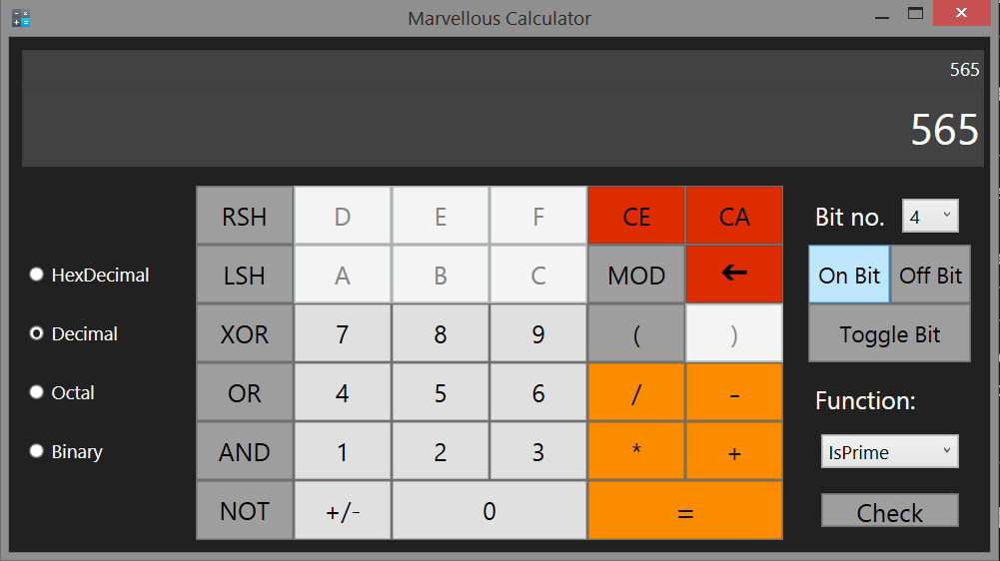

# Marvellous Calculator

It is programmer calculator developed in C# and wpf(Windows Presentation Foundation) using dotnet framework. Calculator can do all basic operation (+ - * /) as well as all bitwise operation (& | ^ >> << )

- Framework: Dot Net.
- Front End: Windows Presentation Foundation (WPF)
- Back End: C#.
- Platform: Windows.

---

## Features

- Providing all function to programmer.
- Use concept of Explicit Dynamic Linked Library(DLL). 
    - Function can be add or modify without re-Compiling whole project.
- Operation is done according Precedence Level of operator.
- Providing convertion value into { Binary , Octal , Decmial, Hex }.
- Provided operation on bit.
- All calculation history is save in file when user say 'yes' at time of closing application.
- Fexible GUI.
- Addition Function like (isPrime , Factor , ... etc). And more function can be add in DLL which can be directly added in calculator.

---
## Project ScreenShot

---
1. First Look of Calculator.

---

2. Follows Precedence levels

---

3. Bitwise operator operation

---
4. Convertion into hex

---
5. Bit opeartion

---
6. Checking if number is prime or not

---
7. Get All factor of given number.

---
8. click 'yes' to save the calculation history.

---